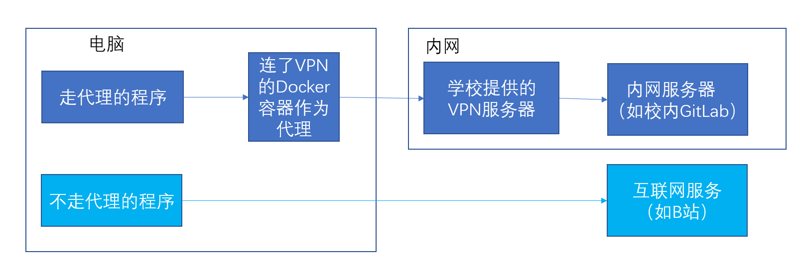

# 连接到VPN的HTTP代理

# 为什么？



VPN可以被用来在外网访问内网资源。但是，一旦连接VPN，系统里的所有流量都会被转发到VPN，对于不需要走VPN的流量，这会带来一些不必要的网络延迟，影响网络速度。

现在的大多数应用程序都支持**代理**(proxy)功能。如果一个应用程序被设置了代理，程序的流量将会被发到代理服务器上，由代理服务器发送到真正的目的地。

所以，如果我们有一个连接到VPN的代理服务器，那么，设置了代理的应用程序的流量就会走VPN，而没有设置这个代理的程序发出的流量就不会经过VPN。

这个项目就是创建docker镜像，它的功能就是上文提到的这个**连接到VPN的代理服务器**。这个容器有两个功能：

1. 连接到VPN
2. 启动一个代理服务器进程，它监听一个端口，并直接转发这些流量

由于这个容器整体连接到了VPN，所以由这个容器发出的流量都会走VPN。所以，我们只需要设置我们需要走VPN的程序的代理程序为`http://localhost:{PORT}`，这样这些程序的流量就会走这个代理，然后走VPN，这样就可以访问内部资源了。

请查看[我博客上的相关文章](https://ddadaal.me/articles/vpn-as-http-proxy)，对VPN、代理以及本方案进行了更详细的介绍。

# 如何使用？

## 配置

1. Clone这个repo
2. 在repo的目录下，创建一个`.env.example`文件的副本，并将副本命名为`.env`
3. 按以下格式修改`.env`文件

```env
PORT=监听的端口，默认为8888
CMD=在容器内连接VPN的命令
```

`configs`文件夹下放了一些大学的`CMD`值的示例。

如果`configs`目录下有您的大学/组织，按照以下步骤操作：

1. 阅读对应文件的开头的注释部分，并按您的情况修改文件最后一行的命令
2. 复制文件最后一行，粘贴到`.env`文件的`CMD=`之后

如果`configs`目录下没有您的组织，您可以按照以下步骤尝试找到连接您的VPN的命令：

1. 运行`docker-compose build`构建镜像
2. 运行`docker run -it --cap-add=NET_ADMIN vpnproxy`启动一个容器
3. 在容器中，借助`openconnect`程序，尝试使用**一行**命令连接到您的VPN
4. 把这个命令添加到`.env`文件的`CMD=`之后
5. （可选）提交一个PR，把您的组织的配置文件提交到`configs`目录下！

注意：

- 只使用这一条命令就能连接到VPN，运行命令后不能再有任何输入（比如输入用户名密码）。所以，您的所有配置（包括用户名密码）都需要被包含在这个命令中
- 命令中请尽量使用双引号包裹命令中的字符串。命令执行的时候会被包括在**一对单引号**中，所以如果您发现您的命令不能正常使用，尝试加点转义符。
- 如果`openconnect`运行起来之后没有自己退出，VPN连接应该就成功了，可以无视之后的报错

## 运行

在`.env`文件配置好之后，按以下方式运行代理：

1. 运行`docker-compose up` （加`-d`后台运行）
2. 把需要走VPN的程序的代理设置为`http://localhost:{PORT}`（{PORT}和`.env`文件里设置的PORT值一致）
3. 容器需要保持运行
4. 使用`Ctrl-C`或者使用`docker kill {container id}`(container id可以通过`docker ps -a`获得)来关闭代理

经测试，在一个容器里连接的VPN不会影响其他容器和主机的网络连接。

# 实现

- Docker base image: `debian:buster-slim`
- VPN client: `openconnect`
- Proxy: `tinyproxy`

